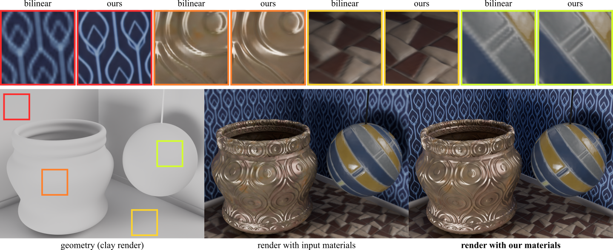

## MatUp: Repurposing Image Upsamplers for SVBRDFs



**MatUp: Repurposing Image Upsamplers for SVBRDFs**<br>
[Alban Gauthier](https://albangauthier.github.io),
[Bernhard Kerbl](https://snosixtyboo.github.io/), 
[Jérémy Levallois](https://research.adobe.com/person/jeremy-levallois/), 
[Robin Faury](https://research.adobe.com/person/robin-faury/), 
[Jean-Marc Thiery](https://research.adobe.com/person/jean-thiery/), 
[Tamy Boubekeur](https://perso.telecom-paristech.fr/boubek/) <br>
*Computer Graphics Forum (Proceedings of EGSR 2024)* <br>
### [Project page](https://perso.telecom-paristech.fr/boubek/papers/MatUp/) | [Paper](https://perso.telecom-paristech.fr/boubek/papers/MatUp/MatUp.pdf) | [Digital Library](https://diglib.eg.org/handle/10.1111/cgf15151)

---

## Citation
```tex
@article{gauthier2024matup,
    journal   = {Computer Graphics Forum},
    title     = {MatUp: Repurposing Image Upsamplers for SVBRDFs},
    author    = {Gauthier, Alban and Kerbl, Bernhard and Levallois, Jérémy 
                and Faury, Robin and Thiery, Jean-Marc and Boubekeur, Tamy}
    year      = {2024},
    volume    = {43},
    number    = {4},
}
```

## Usage

Note: This is my own custom reimplementation of the method. I managed to visually match the quality of the paper but there may be slight differences which prevent me from replicating all results perfectly.

### Python env

```sh
git clone --recurse-submodules https://github.com/AlbanGauthier/matup_egsr
cd matup_egsr

conda create -n matup python=3.8
conda activate matup
pip install -r requirements.txt
```

if you forgot to clone using --recurse-submodules, just use
```sh
git submodule update --init --recursive
```

### Upscalers checkpoints

SwinIR checkpoint: https://github.com/JingyunLiang/SwinIR/releases/download/v0.0/003_realSR_BSRGAN_DFOWMFC_s64w8_SwinIR-L_x4_GAN.pth  
SRFlow checkpoint: On demand (original link is broken: http://data.vision.ee.ethz.ch/alugmayr/SRFlow/pretrained_models.zip from https://github.com/andreas128/SRFlow)
For now, I can send the SRFlow checkpoints on demand (send me an email).

Put them into the folder named 'pretrained_models' (located in the root folder).

### Training

The input material folder can be put into "data" and have the following content:

- data/
    - material_name/
        - SVBRDF/
            - baseColor.png
            - metallic.png
            - height.png
            - normal.png
            - roughness.png

As an example, I am providing a simple example crop of the material victorian_wood

Example usage for training:

```
python main.py
```

Optionnally, you can use "--upscaler swinir/srflow"

## License (MIT)

```
Copyright (c) 2024 - INRIA - Alban Gauthier

Permission is hereby granted, free of charge, to any person obtaining a copy
of this software and associated documentation files (the “Software”), to
deal in the Software without restriction, including without limitation the
rights to use, copy, modify, merge, publish, distribute, sublicense, and/or
sell copies of the Software, and to permit persons to whom the Software is
furnished to do so, subject to the following conditions:

The above copyright notice and this permission notice shall be included in
all copies or substantial portions of the Software.

The Software is provided “as is”, without warranty of any kind, express or
implied, including but not limited to the warranties of merchantability,
fitness for a particular purpose and non-infringement. In no event shall the
authors or copyright holders be liable for any claim, damages or other
liability, whether in an action of contract, tort or otherwise, arising
from, out of or in connection with the software or the use or other dealings
in the Software.
```
